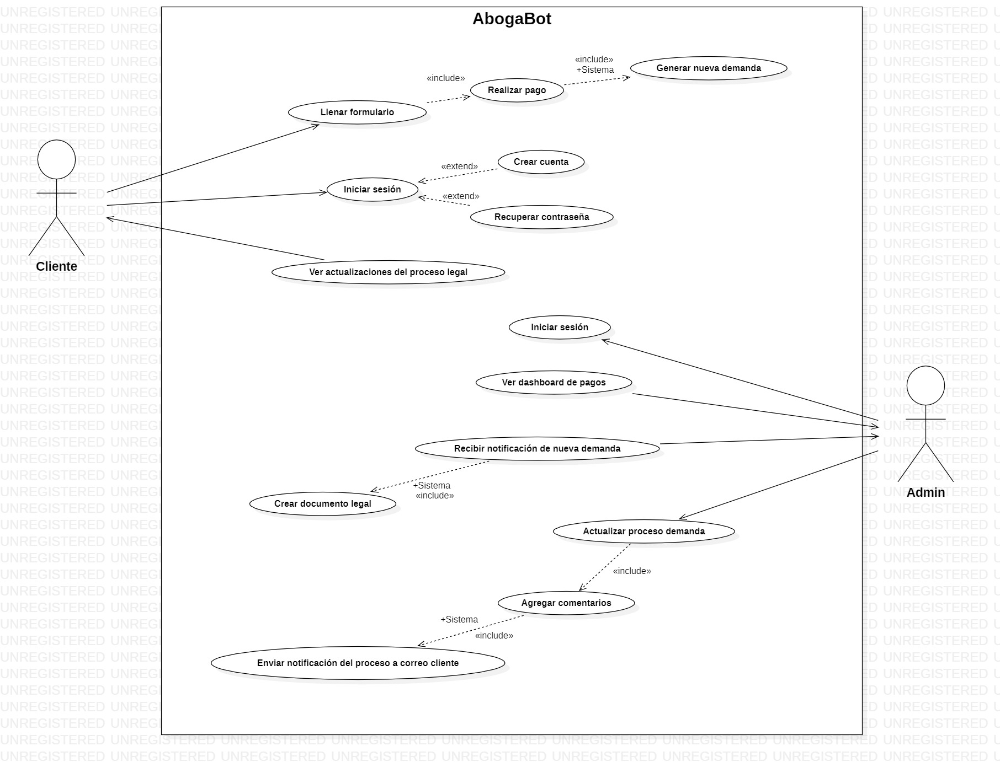
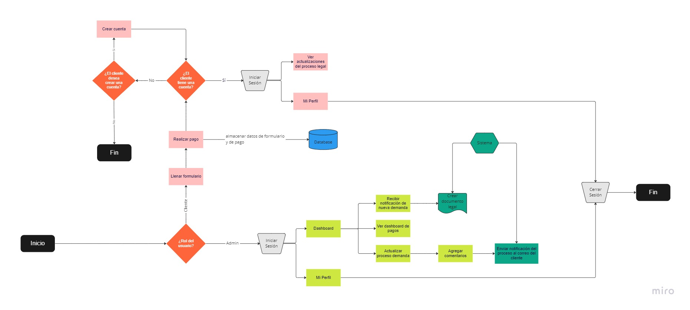
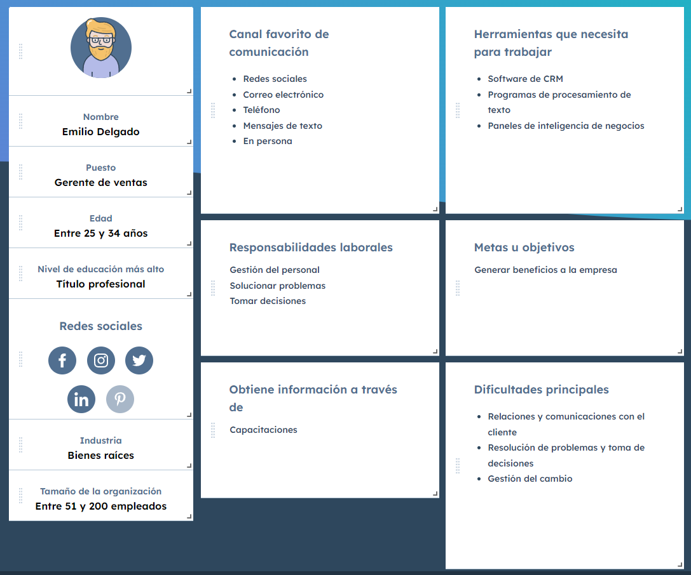
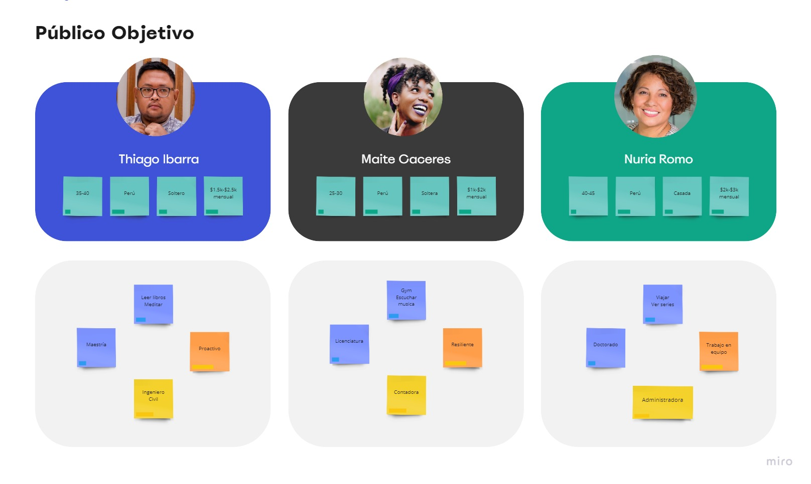

# Abogabot
## Descripción del caso
- Es un despacho de abogados que quiere automatizar las demandas de sus clientes, esto lo harán a través de una página web llenando un formulario.
- Al momento de llenar el formulario se manda al proceso de pago para finalizar la transacción.
- Para dar seguimiento a su demanda, el cliente crea una cuenta en la plataforma y verá el seguimiento de cada una de las actualizaciones del proceso legal.
- El administrador del sitio recibe la notificación de una nueva demanda y con los datos llenados del formulario se crea automáticamente el documento legal en formato word para empezar el proceso.
- El administrador recibe el pago y debe de ser capaz de verlo en un dashboard para ver la cantidad de ingresos recibidos.
- El administrador actualiza el proceso de la demanda y agrega comentarios en cada paso del proceso.
- Al usuario le llegan correos de notificación para saber el avance de su proceso.
- La página debe de ser responsive para poderla ver desde el celular.
- La preferencia de colores del cliente es azul marino y blanco, pero acepta propuestas.

 

## Análisis de Requerimientos
 

### Requerimientos funcionales
 

| CÓDIGO | Nombre del Requerimiento | Descripción |
|:-------------------:|:---:|:---|
| RF001 | Llenar formulario (cliente) | El cliente llena el formulario y continúa el proceso. |
| RF002 | Realizar pago (cliente) | Proceso subsiguiente a “Llenar formulario”, se realiza el proceso de pago para finalizar la transacción. |
| RF003 | Crear cuenta (cliente) | Para dar seguimiento a su demanda, el cliente crea una cuenta en la plataforma. |
| RF004 | Iniciar sesión (cliente/admin) | El cliente o admin inicia sesión y según el rol se renderiza una interfaz distinta. |
| RF005 | Recuperar contraseña (cliente) | Permite recuperar la contraseña al cliente. |
| RF007 | Recibir notificación de nueva demanda (admin) | El administrador del sitio recibe la notificación de una nueva demanda. |
| RF008 | Crear documento legal (sistema) | Con los datos llenados del formulario del cliente se crea automáticamente el documento legal en formato word para empezar el proceso. |
| RF009 | Ver dashboard de pagos (admin) | El administrador recibe el pago y debe de ser capaz de verlo en un dashboard para ver la cantidad de ingresos recibidos. |
| RF010 | Actualizar proceso demanda (admin) | El administrador actualiza el proceso de la demanda y agrega comentarios en cada paso del proceso. |
| RF011 | Enviar notificación del proceso (sistema) | Al usuario (cliente) le llegan correos de notificación para saber el avance de su proceso. |

 

### Requerimientos no funcionales
- La página debe de ser responsive para poderla ver desde el celular.
- La preferencia de colores del cliente es azul marino y blanco.

 

## Diagrama de casos de uso

 

## Diagrama de Flujo de la Aplicación

 

## Buyer Persona

 

## Público Objetivo

 

## Wireframe UX en Miro
Link: https://miro.com/app/board/uXjVPOX2-6o=/?share_link_id=7417783722

 

## UI en Figma
Link: https://www.figma.com/file/g8VakzG8prqPsLqccaQkV1/Abogabot-UI?node-id=0%3A1

